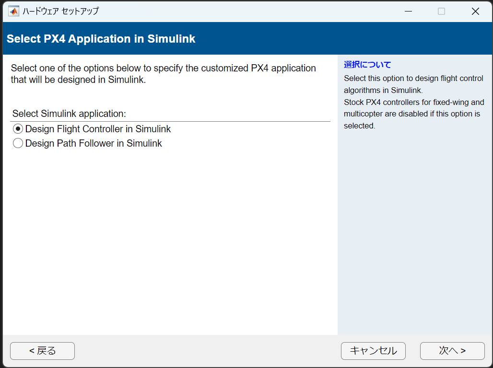
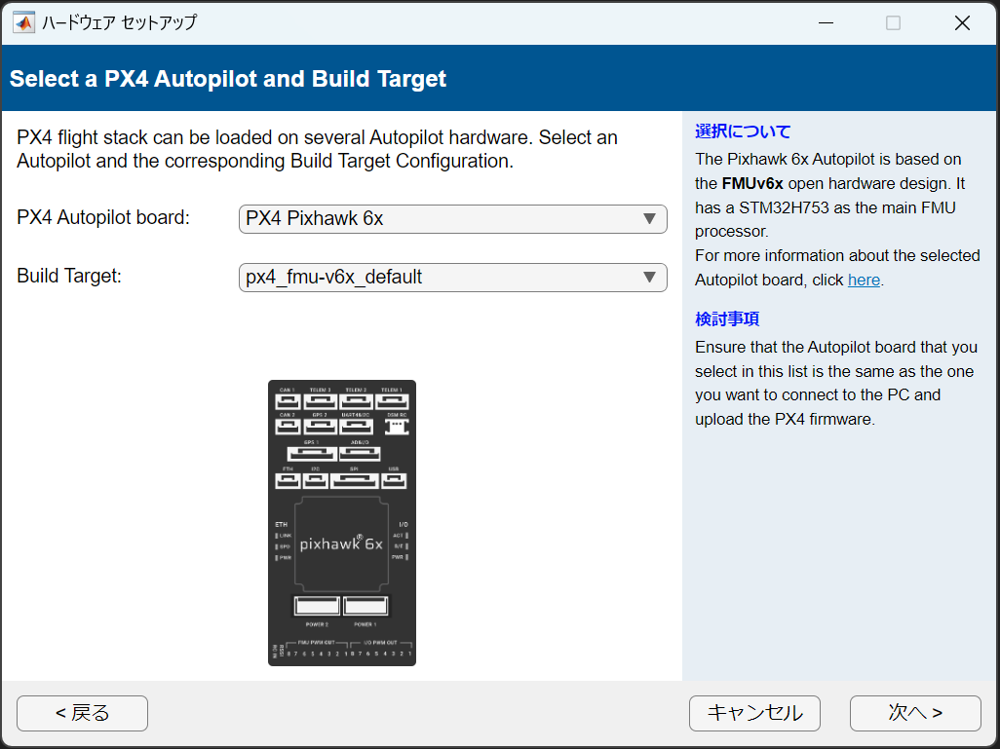
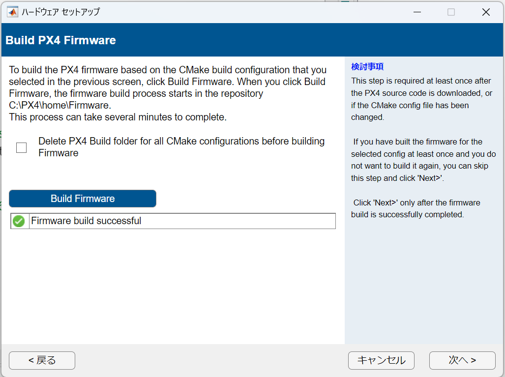
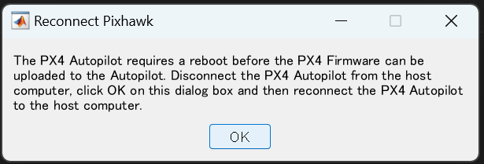
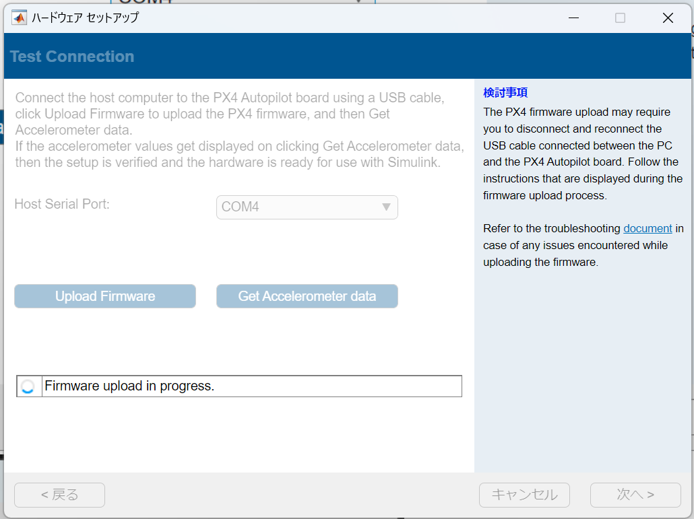
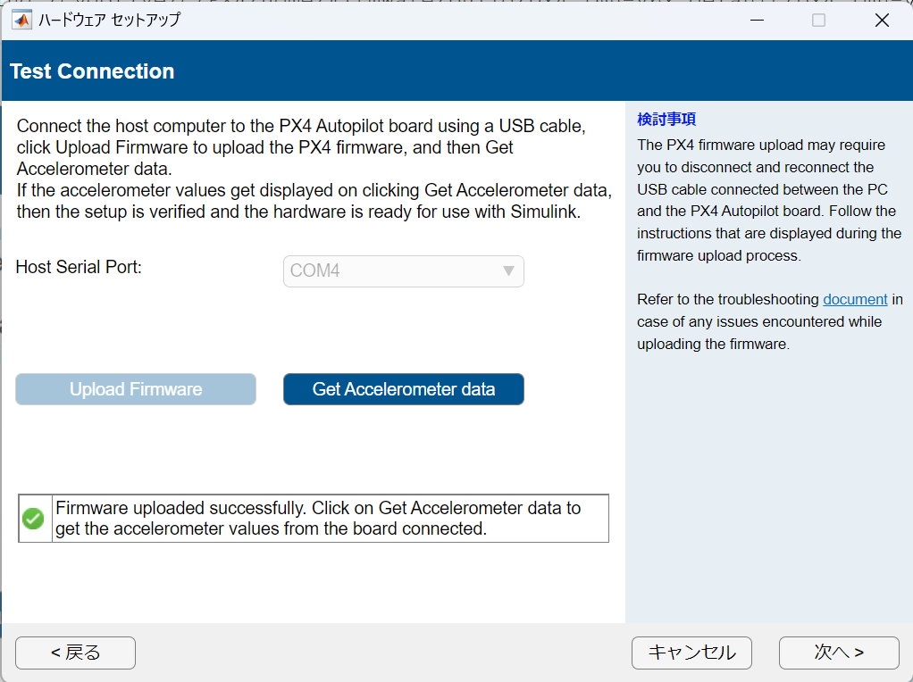
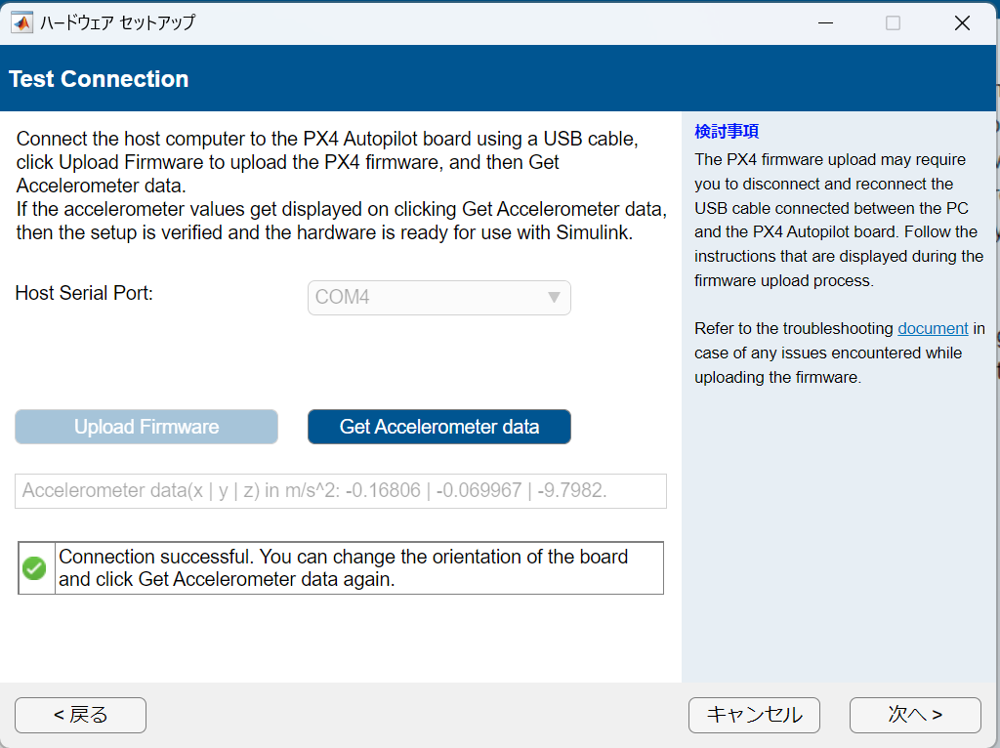
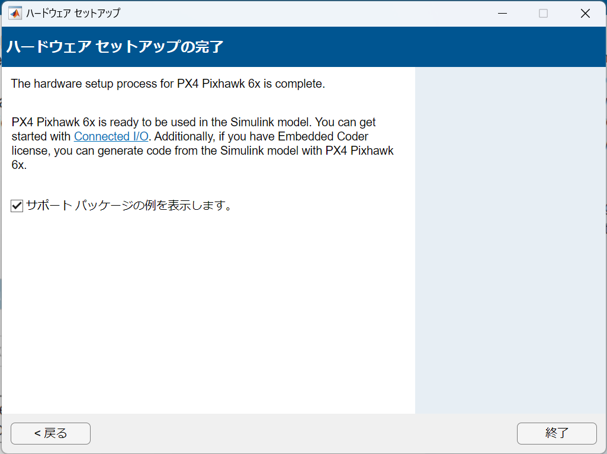
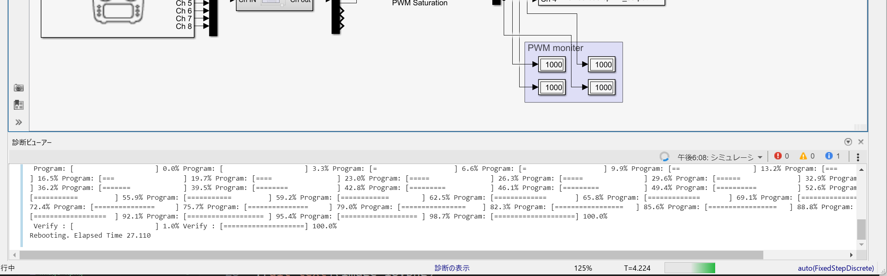

# Setup

Pixhawk 6X はtype C 接続なのでThunderbolt 3 対応ケーブルを用意

## ハードウェアのセットアップ

指示に従い Cygwin toolchain v0.8 をインストール
インストールができていれば以下のように表示される。

 どっちでも良い

QGCでPX4を入れておき、フレームをXタイプに設定する。

書かれている通りケーブルを抜いてからOKを押し、接続しなおす。

## Simulink 上で「IOを使って実行」

出てくるdialogに従い焼きこむ

